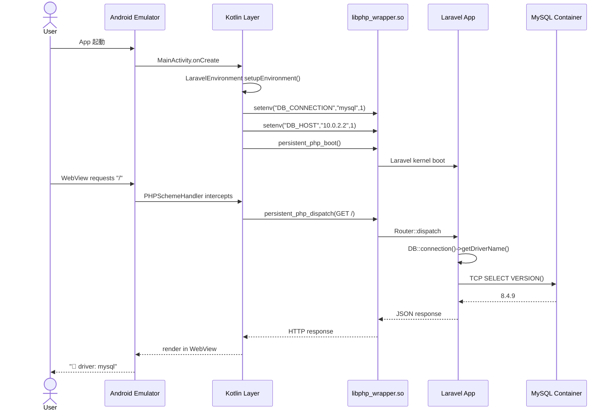
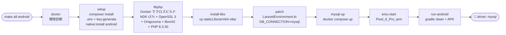

# NativePHP Mobile + MySQL Template


[NativePHP Mobile](https://nativephp.com/) (Laravel を Android/iOS アプリにパッケージする
フレームワーク) に **MySQL 対応** を追加するための独立ビルド環境付きテンプレート。

公式配布の `libphp.a` には `pdo_mysql` / `mysqli` / `mysqlnd` が含まれていないため、
Android NDK でクロスコンパイルした自前の `libphp.a` に差し替えることで、
モバイルアプリから業務 MySQL への直接接続を実現する。

## 実動作検証済

| 項目 | 結果 |
|---|---|
| Android エミュレータ (Pixel 6 Pro / API 34) から MySQL 8.4.9 接続 | ✅ (2026-04-24) |
| **iOS Simulator (iPhone 17 / iOS 26.4) から MySQL 8.4.9 接続** | ✅ (2026-06-04) |
| **Android / iOS から同一リモート MySQL 8.4.5 (LAN) 接続** | ✅ (2026-06-04) |
| `php artisan migrate` (Laravel 13 標準 10 テーブル作成) | ✅ |
| Eloquent CRUD (Create / Read / Update / Delete) | ✅ |
| 日本語 utf8mb4 対応 | ✅ |
| iOS 実機 (arm64-apple-ios) ビルド | 🚧 WIP (configure AC_TRY_RUN hung 既知問題) |

## 動作環境

- **開発ホスト**: macOS Apple Silicon (Intel Mac は未検証)
- **ターゲット**: Android arm64-v8a (API 32+)
- **PHP バージョン**: 8.3.30 (NativePHP 配布と同一)

### 必要ツール

```bash
brew install php@8.3 composer node
brew install --cask android-commandlinetools docker
# iOS 対応の場合: Xcode.app (Mac App Store 経由、約 12 GB)
softwareupdate --install-rosetta --agree-to-license
```

SDK コンポーネント:

```bash
sdkmanager "platform-tools" "platforms;android-35" "build-tools;35.0.0" \
           "ndk;27.0.12077973" "emulator" "system-images;android-34;default;arm64-v8a"
```

## クイックスタート

### 方法 A: GitHub の "Use this template" ボタン

リポジトリ上部の緑色ボタンから派生リポジトリを作成。

### 方法 B: 手動 clone

```bash
git clone https://github.com/NOGUD626/nativephp-mobile-mysql-template.git my-project
cd my-project
rm -rf .git && git init  # 履歴を切り離して新規プロジェクトに
```

### 方法 C: Makefile で一気通貫 🚀

```bash
make doctor         # 環境診断 (mise/php/composer/docker/sdk/ndk/avd/xcode)
make all-android    # Composer install → libphp.a ビルド → 差し替え →
                    #   Kotlin patch → MySQL 起動 → エミュ起動 → APK ビルド
                    #   (初回 30〜60 分、Docker + NDK 初期ダウンロード含む)
make all-ios        # 同様に iOS シミュレータで起動 (Xcode 必須)
```

成功するとエミュレータ画面に Laravel + MySQL の CRUD 結果が表示されます。

利用可能な Makefile target 一覧は `make help` で確認。

## 推奨セットアップ — `mise` でツール pinning

本テンプレートは **macOS Tahoe 26 + Apple Silicon の gradle 無限 hung 問題** ([Issue #2](https://github.com/NOGUD626/nativephp-mobile-mysql-template/issues/2)) を回避するため、[`mise`](https://mise.jdx.dev/) でプロジェクト固有のツールバージョンを `.mise.toml` で pinning しています。

### 利用者の手順

```bash
# 1. mise 本体をインストール
brew install mise

# 2. shell に mise を統合 (zsh の場合)
echo 'eval "$(mise activate zsh)"' >> ~/.zshrc
exec zsh

# 3. プロジェクトに入って mise の信頼許可
cd nativephp-mobile-mysql-template
mise trust

# 4. 各ツールを一括インストール (~5 分)
mise install
# ↑ Java corretto-21.0.8 (JDK-8359830 修正済)
#   Node 20.20.2
#   Ruby 3.3.11 (CocoaPods + Ruby 4.x UTF-8 バグ回避)
```

これで `cd nativephp-mobile-mysql-template/` するだけで自動的に正しい Java/Node/Ruby が選択されます。Make 非対話 shell でも shim 経由で正しい Java が使われるため、**Tahoe での gradle hung 問題が解消** します。

PHP は `mise` の asdf-php プラグインが macOS で依存解決失敗するため `brew install php@8.3` を使用してください。

## ゼロから動作させるまでの 8 ステップ

詳細は [nativephp-test/docs/setup-guide.md](nativephp-test/docs/setup-guide.md) に記載。

```bash
# 1. Laravel / Composer 依存の復元
cd nativephp-test
composer install
cp .env.example .env  # APP_KEY 生成など
php artisan key:generate
echo "NATIVEPHP_APP_ID=com.yourname.yourapp" >> .env

# 2. NativePHP Mobile の Android プロジェクト生成
php artisan native:install android

# 3. 自前 libphp.a をクロスビルド (初回 25〜35 分、要 Docker)
cd ../mobile-libphp-builder
make aarch64 && make install-aarch64

# 4. 生成された .a を NativePHP プロジェクトへ差し替え
DEST=../nativephp-test/nativephp/android/app/src/main/staticLibs/arm64-v8a
cp app/src/main/staticLibs/arm64-v8a/libphp.a     $DEST/
cp app/src/main/staticLibs/arm64-v8a/libssl.a     $DEST/
cp app/src/main/staticLibs/arm64-v8a/libcrypto.a  $DEST/
cp app/src/main/staticLibs/arm64-v8a/libonig.a    $DEST/
cp app/src/main/staticLibs/arm64-v8a/libxml2.a    $DEST/

# 5. Kotlin の DB 設定を MySQL に切替
cd ../nativephp-test
patch -p1 < patches/laravel-environment-mysql.patch

# 6. MySQL サーバー起動 (Docker Compose)
docker compose -f docker-compose.mysql.yml up -d

# 7. Android エミュレータ起動
export ANDROID_HOME=/opt/homebrew/share/android-commandlinetools
export PATH=$ANDROID_HOME/platform-tools:$ANDROID_HOME/emulator:$PATH
emulator -avd Pixel_6_Pro_arm -no-snapshot-save &

# 8. ビルド & デプロイ
cd nativephp/android && ./gradlew clean && cd ../..
php artisan native:run android --build=debug
```

成功すると、エミュレータに `{"status":"ok","driver":"mysql",...}` が表示される。

## アーキテクチャ

### ランタイム (静的構成図 ASCII)

```
 [Android 端末 / エミュレータ]                    [ホスト Mac]
 ┌──────────────────────────────────────┐        ┌─────────────────┐
 │  APK  (com.nogulab.nativephpdemo)     │        │  Docker Compose │
 │  ┌──────────────────────────────┐    │        │                 │
 │  │ WebView (Blade / Livewire)   │    │        │  MySQL 8.4      │
 │  └──────────────┬───────────────┘    │        │  :3306          │
 │                 │ HTTP loopback       │        │                 │
 │  ┌──────────────▼───────────────┐    │        │  nativephp_test │
 │  │ Kotlin 層                    │    │        │  DB             │
 │  │  - MainActivity              │    │        └────────▲────────┘
 │  │  - LaravelEnvironment.kt     │    │                 │
 │  │    setenv DB_CONNECTION=mysql│    │                 │
 │  └──────────────┬───────────────┘    │                 │
 │                 │ JNI                 │                 │
 │  ┌──────────────▼───────────────┐    │                 │
 │  │ libphp_wrapper.so  (25 MB)   │    │                 │
 │  │  ├ libphp.a    ★ 自前ビルド  │    │                 │
 │  │  ├ libsqlite3.a              │    │                 │
 │  │  ├ libssl.a + libcrypto.a    │    │                 │
 │  │  ├ libonig.a  (Oniguruma)    │    │                 │
 │  │  └ libxml2.a                 │    │                 │
 │  └──────────────┬───────────────┘    │                 │
 │                 │ pdo_mysql (mysqlnd) │                 │
 │                 │                      │                 │
 │                 └──────────────────────┼─────────────────┘
 │                             TCP: 10.0.2.2:3306
 └──────────────────────────────────────┘
```

### 起動シーケンス (Mermaid)



### ビルドパイプライン (Mermaid)



詳細は [nativephp-test/docs/architecture.md](nativephp-test/docs/architecture.md)。

## ディレクトリ構成

```
nativephp-mobile-mysql-template/
├── README.md                          # 本ファイル
├── LICENSE                            # MIT
├── .gitignore
│
├── nativephp-test/                    # Laravel + NativePHP Mobile アプリ
│   ├── app/                           # Laravel 業務ロジック
│   ├── config/
│   ├── database/migrations/
│   ├── routes/web.php                 # CRUD テストルート含む
│   ├── docker-compose.mysql.yml       # MySQL 8.4 コンテナ定義
│   ├── patches/
│   │   └── laravel-environment-mysql.patch  # Kotlin DB 設定切替
│   ├── docs/
│   │   ├── prd.md                     # 要求仕様
│   │   ├── architecture.md            # アーキテクチャ詳細
│   │   ├── development-guide.md       # 開発手順
│   │   ├── repository-structure.md    # ディレクトリ責務
│   │   ├── setup-guide.md             # ゼロから再現手順
│   │   └── poc-result.md              # PoC 結果レポート
│   └── .steering/20260424-nativephp-mobile-mysql-poc/
│       ├── requirements.md
│       ├── design.md
│       └── tasklist.md
│
└── mobile-libphp-builder/             # libphp.a クロスビルダー
    ├── Dockerfile                     # Alpine + NDK r27c + クロスビルド
    ├── Makefile
    ├── *.patch                        # PHP ソースに当てるパッチ
    ├── README.md                      # ビルダー概要
    └── docs/
        └── build-guide.md             # ビルダー詳細
```

## 技術スタック

| カテゴリ | 使用バージョン |
|---|---|
| PHP | 8.3.30 (クロスコンパイル済) |
| Laravel | 13.6.0 |
| NativePHP Mobile | 3.2.2 |
| OpenSSL | 3.0.15 |
| Oniguruma | 6.9.9 |
| libxml2 | 2.12.7 |
| SQLite | 3.47.2 |
| MySQL | 8.4.9 (Docker Compose) |
| Android NDK | r27c |
| Android SDK | platforms;android-35, build-tools;35.0.0 |
| Docker Desktop | 27+ (Rosetta 経由 linux/amd64) |

## 含まれる PHP 拡張

- **DB**: pdo, pdo_mysql, mysqli, mysqlnd, pdo_sqlite, sqlite3
- **暗号**: openssl, hash, random
- **文字列**: mbstring (Oniguruma バックエンド)
- **XML**: dom, simplexml, xml, xmlreader, xmlwriter (libxml2 バックエンド)
- **標準**: json, pcre, session, spl, reflection, date, filter, fileinfo, ほか

## iOS 対応 (✅ シミュレータ動作確認済 / 🚧 実機は WIP)

iOS は Android とは別系統 (Xcode + iOS SDK) でクロスビルドする必要があり、
`mobile-libphp-builder/Dockerfile` (Android NDK 専用) ではなく、ホスト macOS の
`mobile-libphp-builder/build-ios.sh` でクロスビルドする。

### 検証済み構成 (2026-06-04)

| 項目 | 内容 |
|---|---|
| ターゲット | iPhone 17 (iOS 26.4) Simulator (arm64-apple-ios-simulator) |
| Xcode | 26.4.1 (Build 17E202) |
| libphp.a | 23 MB (PHP 8.3.30 + mysqlnd + pdo_mysql + openssl + mbstring + dom 等) |
| 接続先 | ローカル MySQL 8.4.9 (Docker) / リモート MySQL 8.4.5 (LAN) 両方 ✅ |
| CRUD + 日本語 utf8mb4 | ✅ |

### iOS 向けに必要なこと

1. **Xcode.app の full インストール** (Mac App Store、約 12 GB)
2. **CocoaPods**: `mise install` の Ruby 3.3 で `gem install cocoapods` を推奨
   (Homebrew Ruby 4.x は CocoaPods と非互換のため不可)
3. **自前 libphp.a の iOS 向けビルド** (`build-ios.sh`):
   - Docker 不可 (Xcode は macOS ネイティブ)
   - `./configure --host=arm-apple-darwin --enable-embed=static`
   - `CC=$(xcrun --sdk iphonesimulator -f clang)`
   - `-isysroot $(xcrun --sdk iphonesimulator --show-sdk-path)`
   - OpenSSL / Oniguruma / libxml2 も同様に iOS SDK で再ビルド
4. **生成した `libphp.a` を `nativephp/ios/Libraries/iphonesimulator/` に配置**
5. **`PersistentPHPRuntime.swift` の `setupEnvironment()` 内**で
   `setenv("DB_CONNECTION", "mysql", 1)` 等 6 行を MySQL 接続情報に書き換え
   (`patches/persistent-php-runtime-mysql.patch` を `make patch-ios` で当てる)

### iOS 動作までの最短手順

```bash
# 1. Xcode インストール後:
sudo xcode-select -s /Applications/Xcode.app/Contents/Developer

# 2. mise + cocoapods 準備 (初回のみ):
brew install mise
echo 'eval "$(mise activate zsh)"' >> ~/.zshrc && exec zsh
cd nativephp-mobile-mysql-template
mise trust && mise install
gem install cocoapods --no-document

# 3. Make ターゲットで一気通貫:
make all-ios
#   ↑ 内部で:
#     - make setup            (NativePHP iOS プロジェクト生成)
#     - make libphp-ios-sim   (シミュレータ向け libphp.a、リポジトリに同梱の成果物があれば即完了)
#     - make install-libs-ios (生成 .a を Xcode プロジェクトに配置)
#     - make patch-ios        (PersistentPHPRuntime.swift の DB 設定 → mysql)
#     - make mysql-up         (Docker MySQL 起動)
#     - make run-ios          (Xcode ビルド + シミュレータ起動)
```

`patches/persistent-php-runtime-mysql.patch` は既にリポジトリに同梱済み。
`make libphp-ios-sim` は `ios-build-iphonesimulator/install/lib/` に成果物が
コミット済みなら秒で完了、無ければ初回 20〜30 分のクロスビルドが走る。

### 実機 (arm64-apple-ios) ビルドの既知問題

`make libphp-ios-device` (`build-ios.sh iphoneos`) は **configure 段階で
AC_TRY_RUN が hung する既知問題** あり (WIP)。シミュレータ動作確認だけなら
`libphp-ios-sim` で十分。実機検証および App Store 配布の検証は未着手。

### iOS 配布時のリスク

- **App Store 審査**: TCP で外部 MySQL サーバーに直接接続する構成は
  App Transport Security との関係で制限される可能性 (社内配布 / TestFlight 想定推奨)
- **シミュレータと実機の ABI 差**: arm64-apple-ios-simulator と arm64-apple-ios で
  2 種類の `.a` が必要 (`Libraries/iphoneos/` と `Libraries/iphonesimulator/`)
- **Code Signing**: 実機配布時に必要 (Apple Developer アカウント)

## トラブルシュート

[nativephp-test/docs/setup-guide.md](nativephp-test/docs/setup-guide.md) のトラブルシュート早見表を参照。

よくある問題:

| 症状 | 対応 |
|---|---|
| `Driver [mysql] not found` | 配布 libphp.a のまま。自前ビルドに差し替え忘れ |
| `Class "DOMDocument" not found` | libxml2 + DOM 拡張が未同梱 |
| `Call to undefined function openssl_*` | OpenSSL 拡張が未同梱 |
| `Connection refused 10.0.2.2:3306` | MySQL コンテナ未起動、Docker Desktop 再起動 |
| Docker build exit 133 | Apple Silicon で x86_64 NDK → `--platform=linux/amd64` 必要 |
| `driver: "sqlite"` のまま | `LaravelEnvironment.kt` / `PersistentPHPRuntime.swift` の patch 適用忘れ |
| `bootstrap/cache directory must be present` | `make setup-storage-dirs` を先に実行 (現 Makefile では `setup` の依存に含まれているので clean 後の一気通貫なら不要) |
| `Gem::GemNotFoundException: can't find gem cocoapods` | Homebrew Ruby 4.x で `pod` が壊れている。`mise install` の Ruby 3.3 + `gem install cocoapods` を使う |
| iOS `configure: error` で hung (実機 SDK) | `libphp-ios-device` の AC_TRY_RUN 既知問題。シミュレータ (`libphp-ios-sim`) で代替 |

## ライセンス

MIT License. 参考にした以下のプロジェクトも MIT:

- [NativePHP Mobile](https://github.com/NativePHP/mobile-air) (MIT)
- [v3l0c1r4pt0r/php-ndk](https://github.com/v3l0c1r4pt0r/php-ndk) (MIT) — `mobile-libphp-builder/` の原型

## 関連リンク

- [NativePHP 公式](https://nativephp.com/)
- [NativePHP Mobile v3 Introduction](https://nativephp.com/docs/mobile/3/getting-started/introduction)
- [v3l0c1r4pt0r blog - PHP on Android](https://re-ws.pl/2024/12/php-build-for-use-bundled-in-android-applications/)

## Contributing

Issue / PR 歓迎。特に以下の分野で協力者を求めてます:

- iOS 実機 (arm64-apple-ios) 向け libphp.a ビルド (configure AC_TRY_RUN hung の解決)
- App Store / TestFlight 配布検証 (ATS と外部 MySQL TCP 接続の整合)
- OpenSSL / Oniguruma / libxml2 以外の依存ライブラリ追加 (libcurl, libsodium, libzip, ICU)
- CI 化 (GitHub Actions + Linux aarch64 NDK でビルド高速化)
- Linux aarch64 ホスト NDK 対応 (Rosetta 経由の遅さを解消)
